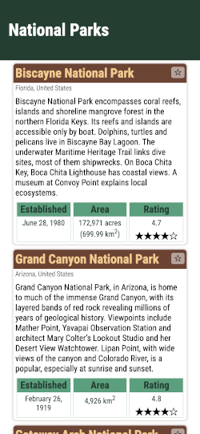
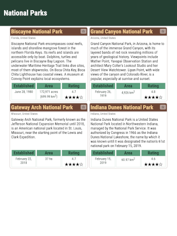
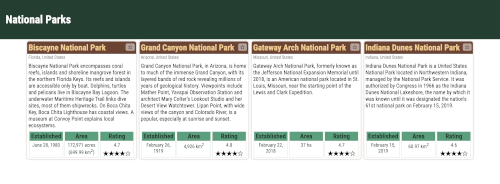

# National Parks

_Practice for Front End Web Development JS DOM Selectors_

## Introduction

This is the starter repository for the practice for the Selecting Elements checkpoints. It comprises an HTML file, a CSS file and an JavaScript file.

## View Demo

For a demonstration of the page visit [this link](https://thinkful-ed.github.io/starter-jsdom-selectors/).

## Getting started

Fork this repository. Use the _Fork_ button at the top right hand corner of the Github page.

Clone your fork of the repository to your local machine.

```bash
git clone https://github.com/<YOUR_GITHUB_USERNAME>/starter-jsdom-selectors.git
```

Navigate to the folder containing the repository and and open the folder in VS Code:

```bash
code .
```

Using VSCode, run the website with the [Live Server extension](https://marketplace.visualstudio.com/items?itemName=ritwickdey.LiveServer) that you installed in an earlier module.

## Tasks

Perform the following tasks. For each task, write a statement that selects the element or elements from the DOM and log the results on the console.

0. Connect the JavaScript file to the HTML

   At the moment the JavaScript is not connected to the HTML. Add the necessary code to the HTML file to connect the JavaScript. If done properly you will see the out "Connected!" on the console when the page is loaded in the browser.

1) Select all elements containing ratings values

   Expect:

   ```
   NodeList(4) [div.value, div.value, div.value, div.value]
   ```

2) Select all elements containing stars that are not shaded

   Expect:

   ```
   NodeList(4) [span.star.half, span.star.half, span.star.half, span.star.half]
   ```

3) Select the entire Gateway Arch park element by id

   Expect:

   ```
    <section class="park" id="ganp">...</section>
   ```

4) Select the element with the established date value for Gateway Arch

   Expect:

   ```
     <div class="value">February 22, 2018</div>
   ```

## Screen Shots

The initial application should look like the following screenshots:







## License

This code is [MIT Licensed](LICENSE)
